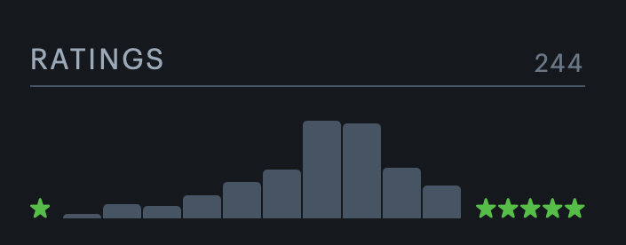
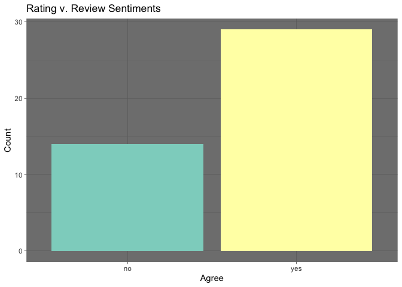

An Analysis of My Letterboxd Reviews
================
by Ye Watcher of Movies, Zander

### Introduction

------------------------------------------------------------------------

I am a film buff. During my gap year, I started a [movie
podcast](https://sarcasmaholiccinema.buzzsprout.com/) (now on hiatus)
and joined [Letterboxd](https://letterboxd.com/arnaoz/), the social
network for movie people. The website has a host of very useful features
like creating a watchlist, catalog of movie ratings (between .5 and 5
stars), and reviews to share with your friends. According to the
statistics on my dashboard, I have watched over 50 movies since the
beginning of this year and rated an additional 200.

For later reference, taken from my Letterboxd profile, here is the
distribution of my ratings.

.

As one can see, the distribution of my ratings is nearly normally and
centered somewhere between 3.5 and 4 stars. I have defined 3 stars as
“average” and tried to rate movies higher or lower than that to reflect
their quality. But do my reviews reflect this distribution? How high or
low do I tend to rate the movies that I review? What words do I use most
frequently in my reviews, and which contribute most to their sentiment
(positive or negative)? I answer these questions by scraping the movie
name, my rating, and review text of [all
61](https://letterboxd.com/arnaoz/films/reviews/) of the reviews I have
left on Letterboxd.

### Write a Function to Scrape My Movie Reviews

------------------------------------------------------------------------

Below I wrote a function which iterates through all six pages (e.g. the
[second page](https://letterboxd.com/arnaoz/films/reviews/page/2/)) of
my Letterboxd website, scrapes HTML data (found using SelectorGadget)
for the movie name, my rating, and review text and finally returns a
tidied data set with 61 observations.

In writing the function, I ran into a few challenges. Firstly, reviews
that contain spoilers (an optional check box at the time of publication)
automatically include “This review may contain spoilers. I can handle
the truth.” as a spoiler warning for visitors. I rarely include spoilers
in my reviews, but there are a few that discuss plot points in my
criticism and so have this string appended to the beginning. I
automatically remove this phrase from all text the function scrapes.

Secondly, I was unable to obtain HTML with SelectorGadget to scrape the
whole text of my lengthiest reviews. After around 430 characters or 80
words (unsure which), Letterboxd limits the representation of a review
and enables a viewer to read the whole text by clicking a “more” widget.
I was unable to reliably get the text after this widget without
selecting many other irrelevant page elements.

Thirdly, I was forced to scrape the HTML for the title and year of each
film together as they are located together on the review page. I again
use `str_replace` to detect and remove the space and year after each
movie title’s text. (I chose to do this rather than separate them
because of the lack reliable separation pattern between title and year.
Perhaps this could be reworked in a subsequent analysis.)

And lastly, character representations of reviews on Letterboxd
(throughout the website) are literal star characters (e.g. “★★”) with an
additional “½” for fractional ratings. In scraping these characters to
obtain data for my rating of each movie I reviewed, I used `str_replace`
to replace all “½”’s with the number .5 and star characters with a
numeric count. The series of `str_replace` functions successfully
converts all possible star ratings between .5 and 5 to their numeric
equivalents.

After these filtering steps are complete, I save the three title,
rating, and text vectors as a data frame for each URL, which is in turn
stored within an empty list of the same length as the numbers of URL’s
input to the functions. I then bind those separate data frames together
to produce a tidy data set. Below I define a character vector with links
to all six pages of my reviews and then use the `scrape_reviews`
function to create a tidy data set with the movie title, my rating, and
review. (This is so cool!!!)

``` r
# create a function to scrape reviews
scrape_reviews <- function(urls) {
  # save an empty list to store output data frames
  empty_list <- vector(mode = "list", length = length(urls))
  
  # sequence along the input character vector of URL's
  for (i in seq_along(urls)) {
    # read the HTML of the ith URL
    reviews <- read_html(urls[i])
    
    # extract the review text  
    text <- html_elements(x = reviews, css = ".collapsible-text") %>% 
       html_text2() %>% 
       str_replace(
       "This review may contain spoilers. I can handle the truth.", "")
          # remove spoiler warning
    
    #extract the movie title 
    movie <- html_elements(x = reviews, css = ".prettify") %>% 
       html_text2() %>% 
       str_replace_all(" [:digit:]", "") %>% 
       str_replace_all("[:digit:]", "")
        # remove year characters
    
     # extract movie rating
     rating <- html_elements(x = reviews, css = ".-green") %>% 
      html_text2() %>% 
       str_replace("½", ".5") %>% 
       str_replace("★★★★★", "5") %>% 
       str_replace("★★★★", "4") %>% 
       str_replace("★★★★★", "5") %>% 
       str_replace("★★★", "3") %>% 
       str_replace("★★", "2") %>% 
       str_replace("★", "1") %>% 
       as.numeric()
          # convert star characters to numeric equivalents
     
     #save movie, rating, and text characters as tibble
      review_data <- tibble(film = movie, 
      rating = rating, review = text)
    
      # save the ith tibble the empty list
      empty_list[[i]] <- review_data
   }
  
  # bind all saved tibbles into one 
  output <- bind_rows(empty_list)
}

# slow scrape_review iteration
scrape_reviews_slow <- slowly(f = scrape_reviews, 
                  rate = rate_delay(1))

# save a character vector of URL's to my reviews
review_urls <- c("https://letterboxd.com/arnaoz/films/reviews/",
   "https://letterboxd.com/arnaoz/films/reviews/page/2/",
   "https://letterboxd.com/arnaoz/films/reviews/page/3/",
   "https://letterboxd.com/arnaoz/films/reviews/page/4/",
   "https://letterboxd.com/arnaoz/films/reviews/page/5/",
   "https://letterboxd.com/arnaoz/films/reviews/page/6/")

# create tibble of my Letterboxd reviews (so cool!)
my_reviews <- scrape_reviews_slow(review_urls)

# visualize the first five reviews as a kable
column_names <- c("Film", "Rating", "Review")

my_reviews %>% head(n = 5) %>% print()
```

    ## # A tibble: 5 x 3
    ##   film            rating review                                                 
    ##   <chr>            <dbl> <chr>                                                  
    ## 1 Bo Burnham: In…    5   "I watched Inside again, and it feels like the emotion…
    ## 2 Training Day       4   "My first Denzel Washington movie. Unexpectedly good! …
    ## 3 Loki               3.5 "\n\nJust finished the finale, and it was better than …
    ## 4 Adaptation.        5   "definitely my favorite from Kaufman. this movie was j…
    ## 5 Black Widow        3.5 "Better than I expected!\n\nAs with Loki, the cinemato…

``` r
  # note: the "text" column was giving kable() problems, so I used the standard 
  #print fucnction instead
```

### An Exploratory Analysis of My Letterboxd Reviews

With my a tibble containing my reviews in hand, I move onto analysis.
Before I move into sentiment analysis, it would likely be interesting to
analyze the kinds of movies I tend to review. Below I visualize as a bar
graph the number of reviews I tend to leave for movies with ratings
between .5 and 5.

``` r
# create frequency graph of n reviews by rating
my_reviews %>% ggplot(aes(x = factor(rating), fill = factor(rating))) +
  geom_bar(show.legend = FALSE) +
  labs(
    title = "Reviews by Movie Rating",
    x = "Rating",
    y = "Count") + 
  scale_fill_brewer(palette = "Set3") +
  theme_dark()
```

<!-- -->

As one can see, the distribution of my reviews is very, very different
from the distribution of my ratings overall. Unknown to me as I have
been leaving reviews, I tend to share my thoughts about movies that I
regard positively, particularly those that are only slightly above
average As mentioned above, I define a rating of 3 as “average”, so it
makes sense given my positive bent that I review movies that are “good”
but still somewhat flawed (so good ground for an analytical review).
This is very interesting.

Taking this a step further, I can sort all of my reviews into two
buckets - those for movies I rate positively and those I regard
negatively. Crucially, this is *different* from my reviews themselves
being positive or negative (which I explore below). Here I am only
visualizing the count of reviews I leave for movies I am positive and
negative about. (Note: I define an “average” 3 rating as “negative”
here; while not formally true, if a movie is average I personally regard
it somewhat negatively.)

``` r
# mutate a variable for rating sentiment
my_reviews <- my_reviews %>% 
  mutate(rating_sentiment = ifelse(rating > 3, "positive", "negative"))

# visualize count of reviews with positve and negative rating
my_reviews %>% 
  ggplot(aes(x = rating_sentiment, fill = rating_sentiment)) + 
  geom_bar(show.legend = FALSE) +
  labs(
    title = "Number of Reviews by Rating Sentiment",
    x = "Rating Sentiment",
    y = "Count") + 
  scale_fill_brewer(palette = "Set3") +
  theme_dark()
```

<!-- -->

This graph confirms what we found above; the strong majority of my
reviews are left for movies which I regard positively. I have always
considered myself a movie optimist; I personally dislike overly negative
or provocative movie criticism. I just love the medium. So, it it very
interesting to receive numerical confirmation of this self-conception.
Leaving a review after watching a movie is a sign of my interest in it.
I do not review every movie I watch, only those where I want to develop
and share my thoughts further. It is clear to me now that those movies
tend to be ones that I like.

### A Word Frequency and Sentiment Analysis of My Letterboxd Reviews

------------------------------------------------------------------------

Now that we have an understanding of the type of movies I tend to
review, let us dig a little deeper. Next we will do a basic word
frequency and sentiment analysis of my reviews (the corpus). We start by
turning our tidy data set into a tidy text format. Below I `unnest`
every individual word as our tokens, then filter for stop words (as
defined by the stop\_words data from tidytext), and then the words I use
most frequently.

``` r
# load stop words data
data(stop_words)

# unnest and filter my reviews for stop words
words_reviews <- my_reviews %>%
  unnest_tokens(output = word, input = review) %>%
  anti_join(stop_words)

# expand "Set3" color palette
mycolors <- colorRampPalette(brewer.pal(12, "Set3"))(301
                                                     )

# create a word frequency graph
words_reviews %>% 
  count(word, sort = TRUE) %>% 
  filter(n > 3) %>% # filter for words used fewer than 3 times
  mutate(word = reorder(word, n)) %>%
  ggplot(aes(n, word, fill = word)) +
  geom_col(show.legend = FALSE) +
  labs(
    title = "Word Frequency",
    x = "Count",
    y = "Word") + 
  scale_fill_manual(values = mycolors) +
  theme_dark()
```

<!-- -->

From the graph above, it becomes clear that I talk about movies in my
reviews (said very sarcastically). Absent the filtering for words that
appear more than three times, Zipf’s law definitely holds here. Generic
film words like “movie”, “film”, “watch”, and “performance” are the most
frequent. And then less frequent but common words like “love”, “awesome”
and “compelling” are more positive, which reflects that my reviews tend
to be about movies I like. And lastly, the less common words that
indicate negative feelings like “weird” and “honestly” communicate that
I do review negative movies, but not as often as I do the positive.

But what about the reviews themselves? Are they positive? Negative? And
how do their sentiments (at least defined by a dictionary lexicon)
compare with my “true” opinion of the movies I review? Below using the
“afinn” sentiment lexicon from tidytext, we analyze whether a word in a
given review is positive or negative and then take the sum of the
positive and negative scores for each review to determine if they are
net positive or negative.

``` r
# appending sentiment value (negative or positive) to text data
afinn_reviews <- words_reviews %>%
  inner_join(get_sentiments("afinn")) %>% 
  mutate(word_sentiment = ifelse(value > 0, "positive", "negative")) 

# categorizing review sentiments as net positive or negative
rating_v_review <- afinn_reviews %>% 
  group_by(film) %>% 
  mutate(review_sentiment = if_else(sum(value) > 0, "positive", "negative"),
    agree = if_else(rating_sentiment == review_sentiment, 
      "yes", "no")) %>% 
      # also, notating if review sentiment aligns with rating sentiment
  select(film, rating_sentiment, review_sentiment, agree) %>% 
  distinct() 
```

With the data above, we know the numerical sentiment of every word and
review on my Letterboxd. Below I display the words that most contribute
positive and negative sentiment to my reviews. I then visualize the
proportion of reviews whose sentiments are positive and negative and
finally the number of agreements and disagreements between my rating and
review sentiments.

``` r
# identify word counts
afinn_word_counts <- afinn_reviews %>% 
  count(word, word_sentiment, sort = TRUE) 

# plot bar chart of sentiment contribution by word
afinn_word_counts %>%
  group_by(word_sentiment) %>%
  slice_max(n, n = 6) %>% 
  ungroup() %>%
  mutate(word = reorder(word, n)) %>%
  ggplot(aes(n, word, fill = word_sentiment)) +
  geom_col(show.legend = FALSE) +
  facet_wrap(~word_sentiment, scales = "free_y") +
   labs(
    title = "Sentiment Contribution by Word",
    x = "Contibution to Sentiment",
    y = "Word") + 
  scale_fill_brewer(palette = "Set3") +
  theme_dark()
```

<!-- -->

The results from the bar graphs above are in line with the raw frequency
count. The “sentiment” words that were near the top in frequency (love,
awesome, weird) there also contribute mostly greatly to the sentiments
of my reviews.

The fact that the most contributing positive words contribute more than
the most contributing negative words is also in line with the prevailing
positivity of my reviews overall (which again is probably a function of
the fact that I tend to review movies that I like). I confirm this below
by visualizing the sum negative and positive sentiments in my reviews.

``` r
# plot bar chart of sum positive and negative sentiment
rating_v_review %>% ggplot(aes(x = review_sentiment, fill = review_sentiment)) + 
  geom_bar(show.legend = FALSE) +
   labs(
    title = "Sum Sentiment",
    x = "Sentiment",
    y = "Total Contribution") + 
  scale_fill_brewer(palette = "Set3") +
  theme_dark()
```

<!-- -->

The graph above formally illustrate just how more substantially positive
my reviews are. The difference between the yellow and green bars is the
net sentiment, which leans heavily toward the positive. Because we have
access to my “true” rating of each movie I reviewed, I suspect that if I
reviewed a greater diversity of film (i.e. films I rated negatively),
that the sentiment would be much less overwhelmingly positive, perhaps
only tilting in that direction.

As a last step, we check the sentiment analysis’s coding of my reviews
against my ratings for that below. Below we plot the proportion of
agreements and disagreements between the (known to be true) sentiment of
my rating and categorization of my review’s sentiment.

``` r
# plot bar chart of sentiment (dis)agreement
rating_v_review %>% ggplot(aes(x = agree, fill = agree)) + 
  geom_bar(show.legend = FALSE) +
   labs(
    title = "Rating v. Review Sentiments",
    x = "Agree",
    y = "Count") + 
  scale_fill_brewer(palette = "Set3") +
  theme_dark()
```

<!-- -->

This graph is a good place to end our analysis. While the overall
sentiment of my reviews may be overwhelmingly positive, there are many
“misses” from the algorithm where it assigned the “wrong” sentiment
relative to my true sentiment (i.e. my rating) about the film I
reviewed. The count of the “no” bar graph demonstrates that a large
share of my reviews are coded by the analysis as negative when they are
in fact positive (and some vice versa). This is entirely too many and
might function to indict the efficacy of the sentiment analysis. This is
a good subject for future exploration (and I just might after this
class!).
